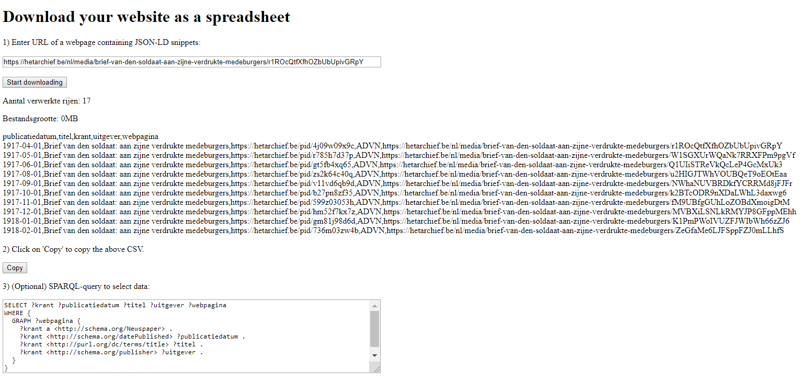

## Demonstrator
{:#demonstrator}

### opentrafficlights.org

<figure id="codepen">

<figcaption markdown="block">
TODO
</figcaption>
</figure>

  See the Pen <a href="https://codepen.io/brechtvdv/pen/BMQPNX/">
  Wachttijd tot groenlicht</a> by Brecht Van de Vyvere (<a href="https://codepen.io/brechtvdv">@brechtvdv</a>)
  on <a href="https://codepen.io">CodePen</a>.

