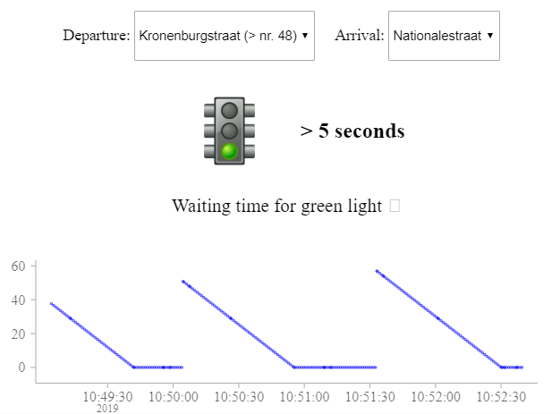

## Demonstrator
{:#demonstrator}

This demonstrator shows that a non-technical user can create a data dump from the cultural heritage website hetarchief.be. More specifically, a spreadsheet can be extracted using SPARQL-querying from embedded paged collection views.
The application is written with the front-end playground Codepen [https://codepen.io/brechtvdv/pen/ebOzXB](https://codepen.io/brechtvdv/pen/ebOzXB). A browser compatible library of Comunica is built  using a custom configuration that can be found on Github ([https://github.com/brechtvdv/hetarchief-comunica](https://github.com/brechtvdv/hetarchief-comunica)) under an Open License.

<figure id="codepen">

<figcaption markdown="block">
A spreadsheet is generated by entering a URL of a newspaper from hetarchief.be.
</figcaption>
</figure>

First, a user can insert a URL of a hypermedia-enabled LOD interface. For example, a user can go to [hetarchief.be](https://hetarchief.be/nl/zoeken/%2A?Filetype%5Bdocument%5D=document) and select a newspaper as starting point.
After pressing _Start downloading_, Comunica starts fetching the entrypoint and follows the embedded pagination controls. During querying, user feedback is provided with the amount of processed CSV rows and bytes.
Next, the user can _Copy_ the CSV output to its clipboard and save it using spreadsheet software.
Optionally, a SPARQL-query can be configured to customize the desired outcome.

See the Pen <a href="https://codepen.io/brechtvdv/pen/ebOzXB/">Download your website as a spreadsheet
</a> by Brecht Van de Vyvere (<a href="https://codepen.io/brechtvdv">@brechtvdv</a>) on <a href="https://codepen.io">CodePen</a>.

