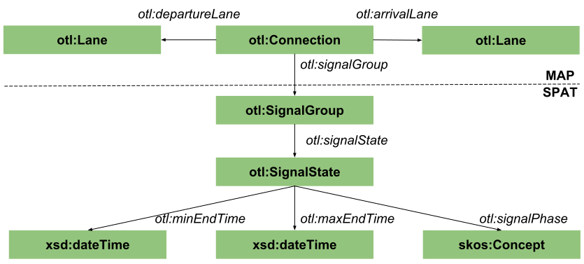
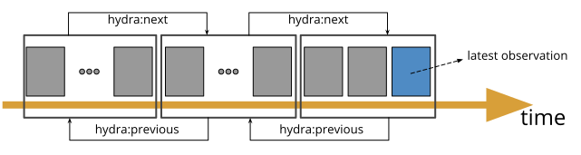
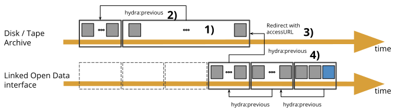

## Open Traffic Lights
{:#implementation}

The [Open Traffic Lights](https://opentrafficlights.org) project started from the need to publish the traffic lights data from the [Smart Zone](https://www.imeccityofthings.be/nl/smart-zone) in [Antwerp](https://www.openstreetmap.org/#map=19/51.21205/4.39717) as Open Data. By using the [Resource Description Framework]() (RDF) as a common model for representing knowledge, sensor observations are syntactically interoperable and can be integrated into one Knowledge Graph. To enable this for traffic lights observations, an ontology is needed to describe the signal phase and timing and how traffic can move over the intersection.

The MAP and SPAT messages are available through a closed message broker (cfr. [MQTT](https://mosquitto.org/)) with a frequency of 200 milliseconds which corresponds with the cycle time of the Traffic Control System of the intersection. In the [specification](#Specification) section, we will describe how the amount of data messages can be optimized for Open Data publishing and how historical information is still retrievable, in contrast to the broker interface.

The ontology is based on two Flemish profiles: the MapData (MAP) and the Signal Phase and Timing (SPAT) profile. While MAP focuses on describing the topology of an intersection, describes SPAT the timing of the phase that a traffic light adheres to. Both profiles are conform European Telecommunications Standards Institute (ETSI) standards: [ETSI 103 301](https://www.etsi.org/deliver/etsi_ts/103300_103399/103301/01.01.01_60/ts_103301v010101p.pdf), [ETSI TS102 894-2](https://www.etsi.org/deliver/etsi_ts/102800_102899/10289402/01.01.01_60/ts_10289402v010101p.pdf), but are not available under an Open license.

### Ontology
 {:#ontology}

The Open Traffic Lights ontology is currently scoped to the data that is published by the Smart Zone. It is publicly available under an Open license: [https://w3id.org/opentrafficlights#](https://w3id.org/opentrafficlights#) with prefix otl. [](#otl-ontology) shows an overview of all the supported classes and properties that are defined.

<figure id="otl-ontology">
<center>

</center>
<figcaption markdown="block">
Classes and properties for describing MAP/SPAT related knowledge.
</figcaption>
</figure>

According to the driving direction of the road user, the lane _otl:Lane_ that goes towards the conflict area of the intersection is described with a _otl:departureLane_, mutatis mutandis for the _otl:arrivalLane_. If a road user can maneuver from a departure lane towards an arrival lane, than this is called a _otl:Connection_. 

A connection is possible according to the _otl:SignalState_ of the traffic light. Instead of referring to a traffic light, the SPAT profile coins the term _otl:SignalGroup_ for the collection of traffic lights that continuously share a signal state. The latter is characterized by the following relations:

* **otl:signalPhase**: points to a [SKOS concept](http://www.w3.org/2004/02/skos/core#Concept) that represents the signal phase. This concept represents a color (green, orange flashing, etc.).
* **otl:minEndTime**: the earliest time that the signal phase will change. 
* **otl:maxEndTime**: the maximum time that the signal group will remain in this signal phase.

In the SPAT profile, the signal phase is described using a text field, e.g. “protected-Movement-Allowed”, which means that a road user can safely cross the intersection (a green light). To allow semantic interoperability with foreign countries, we made a taxonomy of possible signal phases which can be dereferenced by HTTP clients. The taxonomy is publicly available at [https://w3id.org/opentrafficlights/thesauri/signalphase](https://w3id.org/opentrafficlights/thesauri/signalphase) under an Open license.

In next section, we will describe a Web Application Programming Interface specification to publish traffic light observations for Open Data re-use. 

### Specification
{:#specification}

The specification contains three aspects:

* how every traffic light observation must be described,
* how the server interface exposes the live observations,
* how historical observations must be published

Every observation _must_ be defined using [instantaneous graphs (iGraphs) and stream graphs (sGraphs)](cite:cites barbieri2010proposal). The iGraph contains the observated content, in this case the signal phase and timing of signal group(s). The sGraph describes metadata about the observation: when the observation is generated. [](#example-observation) shows as example the signal phase and timing observed at 2018-10-31T14:58:23.205Z for signal group *https://opentrafficlights.org/id/signalgroup/K648/6*. 

<figure id="example-observation" class="listing">
````/code/example-observation.txt````
<figcaption markdown="block">
Observation that signal group 6 has a certain state at 2018-10-31T14:58:23.205Z.
</figcaption>
</figure>

SPAT messages are sent every cycle time of a Traffic Control System. For the TCS in Antwerp, which has a cycle time every 200 ms, this corresponds with 5 observations per second. To lower the amount of messages, a server _must_ calculate the final outcome that an end-user will see and only publish if this changes. A new observation therefore is published whenever the minimum and maximum count-down (now - otl:minEndTime/otl:maxEndTime) in seconds or the otl:signalPhase changes. This results in the generation of one observation per second.

There are two main strategies to publish live data: a publish/subcribe system where an observation is pushed to the client and HTTP polling where the client pulls a Linked Data Fragment repeatedly. 
The data publisher _must_ offer HTTP polling and _should_ offer pub/sub:

* **HTTP polling**: a Linked Data Fragment which is a HTTP document containing one or more of the most recent observations (e.g. _https://lodi.ilabt.imec.be/observer/rawdata/latest_). The _ETag_ header must be added to enable HTTP caching.
* **publish/subscribe**: every update corresponds with one observation like [](#example-observation). Preferably, HTTP-based [Server-Sent Events](https://developer.mozilla.org/en-US/docs/Web/API/Server-sent_events/Using_server-sent_events) _should_ be chosen.

Historical data are published as Linked Data Fragments similar to the HTTP polling approach. [](#timeseries) shows that all observations are ordered on a time axis: the Linked Data Fragments **select** data based on time ranges. To allow a HTTP client to automatically discover older observations, a _hydra:previous_ **hypermedia** link _must_ be added using the [Hydra](https://www.hydra-cg.com/spec/latest/core/) vocabulary. _Hydra:next_ links _should_ be added to allow time range retrieval in both directions. Also, the URL of the fragment is identified using the datetime of its first observation (e.g. https://opentrafficlights.org/spat/K648?time=2018-10-31T14:58:23.205Z).

<figure id="timeseries">
<center>

</center>
<figcaption markdown="block">
Timeseries are published as a paged collection of time sorted Linked Data Fragments. 
</figcaption>
</figure>

Another feature that the interface _must_ expose is *[templated links](https://www.hydra-cg.com/spec/latest/core/#templated-links)*: a client should be able to construct a URL to retrieve the fragment that contains observations around a certain *time* parameter. [](#templated-link) gives an example on how to express this **hypermedia** control. The server _must_ redirect with a HTTP 302 status code to the fragment whose time range encapsulates *time*. When missing, the last fragment is returned.

<figure id="templated-link" class="listing">
````/code/templated-link.txt````
<figcaption markdown="block">
A client can search for observations with a datetime as input parameter.
</figcaption>
</figure>

Finally, following **metadata** _must_ be added to every fragment:

* the **topology** of the intersection (MAP): when available, the identifiers of the lanes of the local authorities should be reused. Otherwise, a lane should be defined using _otl:Lane_ and use _http://purl.org/dc/terms/description_ and _http://www.opengis.net/#geosparql/wktLiteral_ to allow user agents select a lane.
* an Open **License** (cfr. [CC-0](https://creativecommons.org/publicdomain/zero/1.0/))

In next section, a method will be proposed for long-term preservation of these fragments.

### Preservation strategy
{:#preservation}

With our specification, one observation with the average size of 7 kilobytes is published every second which generates more than a half gigabytes per day. It is important that inactive data is removed from the Open Data server to keep it light-weight, however, these should still be available for retrieval. 

Storage solution tape require a different approach for preserving traffic lights data. As discussed in the background, tape is cost-efficient for large files. To circumvent this, Linked Data Fragments can be merged into one bigger Linked Data Fragment. This means that not the exact bytes are preserved, but only the statements. Validating with [_graph isomorphism_](cite:cites carroll2002matching) is not possible as the merged graph contains more statements than the original graphs that needs to be compared with, but the ideas of generating an equivalence mapping between blank nodes can be re-used for statements preservation. With these merged fragments archiving traffic lights data on tape becomes feasible. For disk archives, there is no need to create bigger files, thus archiving can be done traditionally as explained in [section 2](#background).

There are four aspects on synchronizing archives with our specification for traffic lights data ([](#timeseries-archive)):

 1. archives need to harvest and optionally merge the Linked Data Fragments by following the provided hypermedia links in the Open Data interface
 2. a hypermedia link is added to its previous harvested fragment
 3. an access URL is exposed by the archive that redirects to the latest harvested fragment
 4. the last published fragment of the Open Data interface links to this access URL so the Linked Open Data interface constitutes with the archive

<figure id="timeseries-archive">
<center>

</center>
<figcaption markdown="block">
An archive can harvest the historical observations, optionally merge the Linked Data statements of multiple documents into one document, and link everything together through previous links.
</figcaption>
</figure>


